# Propuesta de Arquitectura Técnica
## Sistema de Gestión de Tickets para Atención en Sucursales

**Proyecto**: Ticketero Digital con Notificaciones en Tiempo Real  
**Cliente**: Institución Financiera  
**Versión**: 2.0  
**Fecha**: Diciembre 2025  
**Preparado por**: Arquitecto de Software Senior

---

## 1. Resumen Ejecutivo

Esta propuesta define la arquitectura técnica para el sistema de gestión de tickets basado en **Java 21**, **Spring Boot 3.2** y **PostgreSQL**. Se implementa una **Arquitectura Hexagonal** que garantiza separación de responsabilidades, testabilidad y evolución hacia microservicios.

### Stack Tecnológico Principal
- **Backend**: Java 21 + Spring Boot 3.2
- **Arquitectura**: Hexagonal (Ports & Adapters)
- **Base de Datos**: PostgreSQL 16
- **Migraciones**: Flyway
- **Notificaciones**: Telegram Bot API
- **Contenedores**: Docker + Docker Compose

---

## 2. Arquitectura Hexagonal

### 2.1 Diagrama de Arquitectura General

```mermaid
graph TB
    subgraph "Adaptadores de Entrada"
        WEB["🌐 REST Controllers"]
        EVENT["📨 Event Listeners"]
    end
    
    subgraph "Capa de Aplicación"
        UC1["📋 Create Ticket UseCase"]
        UC2["⚡ Assign Ticket UseCase"]
        UC3["📊 Queue Management UseCase"]
        UC4["🔔 Notification UseCase"]
    end
    
    subgraph "Dominio (Core)"
        TICKET["🎫 Ticket"]
        QUEUE["📋 Queue"]
        EXEC["👤 Executive"]
        RULES["⚖️ Business Rules"]
    end
    
    subgraph "Adaptadores de Salida"
        DB["🗄️ PostgreSQL Adapter"]
        TELEGRAM["📱 Telegram Adapter"]
        AUDIT["📝 Audit Adapter"]
        METRICS["📈 Metrics Adapter"]
    end
    
    WEB --> UC1
    WEB --> UC2
    WEB --> UC3
    EVENT --> UC4
    
    UC1 --> TICKET
    UC2 --> TICKET
    UC2 --> EXEC
    UC3 --> QUEUE
    UC4 --> TICKET
    
    UC1 --> DB
    UC2 --> DB
    UC3 --> DB
    UC4 --> TELEGRAM
    UC1 --> AUDIT
    UC2 --> METRICS
```



### 2.2 Estructura de Capas

| Capa | Responsabilidad | Dependencias |
|------|----------------|---------------|
| **Dominio** | Lógica de negocio pura | Ninguna (independiente) |
| **Aplicación** | Casos de uso y orquestación | Solo dominio |
| **Adaptadores** | Detalles técnicos e integraciones | Aplicación y frameworks |

### 2.3 Estructura de Paquetes Hexagonal

```
com.financiera.ticketero
├── domain/                           # NÚCLEO - Lógica de negocio
│   ├── ticket/
│   │   ├── model/
│   │   │   ├── Ticket.java          # Entidad de dominio
│   │   │   ├── TicketId.java        # Value Object
│   │   │   └── TicketRepository.java # Puerto (interface)
│   │   ├── service/
│   │   │   └── TicketDomainService.java
│   │   └── events/
│   │       ├── TicketCreated.java
│   │       └── TicketAssigned.java
│   ├── queue/
│   │   ├── model/
│   │   │   ├── Queue.java
│   │   │   └── QueueRepository.java
│   │   └── service/
│   │       └── QueueManagementService.java
│   └── executive/
│       ├── model/
│       │   ├── Executive.java
│       │   └── ExecutiveRepository.java
│       └── service/
│           └── ExecutiveAssignmentService.java
│
├── application/                      # CASOS DE USO
│   ├── ticket/
│   │   ├── usecase/
│   │   │   ├── CreateTicketUseCase.java
│   │   │   └── AssignTicketUseCase.java
│   │   ├── port/
│   │   │   ├── in/                  # Puertos de entrada
│   │   │   │   └── TicketManagementPort.java
│   │   │   └── out/                 # Puertos de salida
│   │   │       ├── NotificationPort.java
│   │   │       └── AuditPort.java
│   │   └── dto/
│   │       ├── TicketCreationRequest.java
│   │       └── TicketResponse.java
│   ├── queue/
│   │   ├── usecase/
│   │   │   └── ManageQueueUseCase.java
│   │   └── port/
│   │       └── out/
│   │           └── MetricsPort.java
│   └── notification/
│       ├── usecase/
│       │   └── SendNotificationUseCase.java
│       └── port/
│           └── out/
│               └── MessageDeliveryPort.java
│
└── infrastructure/                   # ADAPTADORES
    ├── adapter/
    │   ├── in/                      # Adaptadores de entrada
    │   │   ├── web/
    │   │   │   ├── TicketController.java
    │   │   │   └── QueueController.java
    │   │   └── messaging/
    │   │       └── EventListener.java
    │   └── out/                     # Adaptadores de salida
    │       ├── persistence/
    │       │   ├── jpa/
    │       │   │   ├── TicketJpaRepository.java
    │       │   │   └── TicketRepositoryAdapter.java
    │       │   └── mapper/
    │       │       └── TicketMapper.java
    │       ├── notification/
    │       │   └── TelegramAdapter.java
    │       └── audit/
    │           └── AuditAdapter.java
    └── config/
        ├── ApplicationConfig.java
        └── DatabaseConfig.java
```

---

## 3. Flujo de Datos y Casos de Uso

### 3.1 Diagrama de Flujo - Creación de Ticket


### 3.2 Diagrama de Flujo - Asignación de Ticket


---

## 4. Diseño del Dominio

### 4.1 Diagrama de Dominio


### 4.2 Agregados y Value Objects

#### Ticket (Agregado Raíz)
```java
// domain/ticket/model/Ticket.java
public class Ticket {
    private final TicketId id;
    private final CustomerId customerId;
    private final QueueType queueType;
    private TicketStatus status;
    private final LocalDateTime createdAt;
    private ExecutiveId assignedExecutive;
    private Integer position;
    private Duration estimatedWaitTime;
    
    public static Ticket create(CustomerId customerId, QueueType queueType) {
        return new Ticket(
            TicketId.generate(),
            customerId,
            queueType,
            TicketStatus.WAITING,
            LocalDateTime.now()
        );
    }
    
    public void assignToExecutive(ExecutiveId executiveId) {
        if (this.status != TicketStatus.WAITING) {
            throw new IllegalStateException("Solo tickets en espera pueden ser asignados");
        }
        this.assignedExecutive = executiveId;
        this.status = TicketStatus.IN_PROGRESS;
    }
}
```

#### Value Objects
```java
// domain/ticket/model/TicketId.java
public record TicketId(UUID value) {
    public static TicketId generate() {
        return new TicketId(UUID.randomUUID());
    }
}

// domain/ticket/model/CustomerId.java
public record CustomerId(String rut) {
    public CustomerId {
        if (rut == null || rut.trim().isEmpty()) {
            throw new IllegalArgumentException("RUT no puede estar vacío");
        }
    }
}
```

### 4.3 Puertos del Dominio

```java
// domain/ticket/model/TicketRepository.java
public interface TicketRepository {
    Ticket save(Ticket ticket);
    Optional<Ticket> findById(TicketId id);
    List<Ticket> findByQueueTypeAndStatus(QueueType queueType, TicketStatus status);
    List<Ticket> findWaitingTicketsOrderedByCreation(QueueType queueType);
}

// domain/executive/model/ExecutiveRepository.java
public interface ExecutiveRepository {
    Optional<Executive> findAvailableByQueueType(QueueType queueType);
    List<Executive> findByStatus(ExecutiveStatus status);
    Executive save(Executive executive);
}
```

### 4.4 Estados y Transiciones

```mermaid
stateDiagram-v2
    [*] --> WAITING : Ticket creado
    WAITING --> CALLED : Posición ≤ 3
    CALLED --> IN_PROGRESS : Asignado a ejecutivo
    IN_PROGRESS --> COMPLETED : Atención finalizada
    WAITING --> CANCELLED : Timeout o cancelación
    CALLED --> CANCELLED : No se presenta
    
    note right of WAITING : Cliente en cola
    note right of CALLED : Debe acercarse
    note right of IN_PROGRESS : Con ejecutivo
    note right of COMPLETED : Servicio terminado
    note right of CANCELLED : Ticket inválido
```



---

## 5. Capa de Aplicación - Casos de Uso

### 5.1 Casos de Uso Principales

```java
// application/ticket/usecase/CreateTicketUseCase.java
@UseCase
public class CreateTicketUseCase {
    private final TicketRepository ticketRepository;
    private final QueueManagementService queueService;
    private final NotificationPort notificationPort;
    private final AuditPort auditPort;
    
    public TicketResponse execute(CreateTicketCommand command) {
        // 1. Crear ticket de dominio
        Ticket ticket = Ticket.create(
            new CustomerId(command.rut()),
            command.queueType()
        );
        
        // 2. Calcular posición en cola
        int position = queueService.calculatePosition(command.queueType());
        ticket.updatePosition(position);
        
        // 3. Persistir
        ticket = ticketRepository.save(ticket);
        
        // 4. Notificar
        notificationPort.sendConfirmation(ticket);
        
        // 5. Auditar
        auditPort.logTicketCreation(ticket);
        
        return TicketResponse.from(ticket);
    }
}

// application/ticket/usecase/AssignTicketUseCase.java
@UseCase
public class AssignTicketUseCase {
    private final TicketRepository ticketRepository;
    private final ExecutiveRepository executiveRepository;
    private final NotificationPort notificationPort;
    
    public AssignmentResponse execute(AssignTicketCommand command) {
        // 1. Buscar próximo ticket
        Ticket ticket = ticketRepository
            .findNextWaitingTicket(command.queueType())
            .orElseThrow(() -> new NoTicketsWaitingException());
            
        // 2. Buscar ejecutivo disponible
        Executive executive = executiveRepository
            .findAvailableByQueueType(command.queueType())
            .orElseThrow(() -> new NoExecutiveAvailableException());
            
        // 3. Asignar
        ticket.assignToExecutive(executive.getId());
        executive.assignTicket(ticket.getId());
        
        // 4. Persistir cambios
        ticketRepository.save(ticket);
        executiveRepository.save(executive);
        
        // 5. Notificar al cliente
        notificationPort.sendCallNotification(ticket, executive);
        
        return AssignmentResponse.from(ticket, executive);
    }
}
```

### 5.2 Puertos de Aplicación

```java
// application/ticket/port/in/TicketManagementPort.java
public interface TicketManagementPort {
    TicketResponse createTicket(CreateTicketCommand command);
    AssignmentResponse assignTicket(AssignTicketCommand command);
    void cancelTicket(CancelTicketCommand command);
    TicketResponse getTicketStatus(TicketId ticketId);
}

// application/ticket/port/out/NotificationPort.java
public interface NotificationPort {
    void sendConfirmation(Ticket ticket);
    void sendCallNotification(Ticket ticket, Executive executive);
    void sendCancellationNotification(Ticket ticket);
}

// application/ticket/port/out/AuditPort.java
public interface AuditPort {
    void logTicketCreation(Ticket ticket);
    void logTicketAssignment(Ticket ticket, Executive executive);
    void logTicketCompletion(Ticket ticket);
}
```

---

## 6. Estrategia de Persistencia

### 6.1 Adaptadores de Persistencia

```java
// infrastructure/adapter/out/persistence/TicketRepositoryAdapter.java
@Repository
public class TicketRepositoryAdapter implements TicketRepository {
    private final TicketJpaRepository jpaRepository;
    private final TicketMapper mapper;
    
    @Override
    public Ticket save(Ticket ticket) {
        TicketEntity entity = mapper.toEntity(ticket);
        entity = jpaRepository.save(entity);
        return mapper.toDomain(entity);
    }
    
    @Override
    public List<Ticket> findWaitingTicketsOrderedByCreation(QueueType queueType) {
        return jpaRepository
            .findByQueueTypeAndStatusOrderByCreatedAt(queueType, TicketStatus.WAITING)
            .stream()
            .map(mapper::toDomain)
            .toList();
    }
}
```

### 6.2 Esquema de Base de Datos

```sql
-- Migración V1__Create_tickets_table.sql
CREATE TABLE tickets (
    id UUID PRIMARY KEY,
    customer_id VARCHAR(20) NOT NULL,
    queue_type VARCHAR(20) NOT NULL,
    status VARCHAR(20) NOT NULL,
    created_at TIMESTAMP NOT NULL,
    assigned_executive_id UUID,
    position INTEGER,
    estimated_wait_minutes INTEGER,
    version INTEGER DEFAULT 0
);

CREATE INDEX idx_tickets_queue_status_created 
    ON tickets(queue_type, status, created_at);

CREATE INDEX idx_tickets_customer 
    ON tickets(customer_id);

-- Migración V2__Create_executives_table.sql
CREATE TABLE executives (
    id UUID PRIMARY KEY,
    name VARCHAR(100) NOT NULL,
    status VARCHAR(20) NOT NULL,
    branch_id UUID NOT NULL,
    supported_queues TEXT[],
    last_assignment TIMESTAMP,
    version INTEGER DEFAULT 0
);

CREATE INDEX idx_executives_status_queues 
    ON executives(status, supported_queues);
```

### 6.3 Diagrama de Base de Datos


---

## 7. Adaptadores de Infraestructura

### 7.1 Adaptador Web (Entrada)

```java
// infrastructure/adapter/in/web/TicketController.java
@RestController
@RequestMapping("/api/v1/tickets")
public class TicketController {
    private final TicketManagementPort ticketManagement;
    
    @PostMapping
    public ResponseEntity<TicketResponse> createTicket(
            @Valid @RequestBody CreateTicketRequest request) {
        
        CreateTicketCommand command = new CreateTicketCommand(
            request.rut(),
            request.queueType()
        );
        
        TicketResponse response = ticketManagement.createTicket(command);
        return ResponseEntity.status(HttpStatus.CREATED).body(response);
    }
    
    @GetMapping("/{ticketId}")
    public ResponseEntity<TicketResponse> getTicketStatus(
            @PathVariable String ticketId) {
        
        TicketId id = new TicketId(UUID.fromString(ticketId));
        TicketResponse response = ticketManagement.getTicketStatus(id);
        return ResponseEntity.ok(response);
    }
}
```

### 7.2 Adaptador Telegram (Salida)

```java
// infrastructure/adapter/out/notification/TelegramAdapter.java
@Component
public class TelegramAdapter implements NotificationPort {
    private final TelegramBot telegramBot;
    private final RetryTemplate retryTemplate;
    
    @Override
    public void sendConfirmation(Ticket ticket) {
        String message = buildConfirmationMessage(ticket);
        
        retryTemplate.execute(context -> {
            telegramBot.sendMessage(
                ticket.getCustomerId().rut(),
                message
            );
            return null;
        });
    }
    
    @Override
    public void sendCallNotification(Ticket ticket, Executive executive) {
        String message = String.format(
            "🔔 ¡Su turno está listo!\n" +
            "Ticket: %s\n" +
            "Ejecutivo: %s\n" +
            "Módulo: %s",
            ticket.getId().value(),
            executive.getName(),
            executive.getModule()
        );
        
        retryTemplate.execute(context -> {
            telegramBot.sendMessage(
                ticket.getCustomerId().rut(),
                message
            );
            return null;
        });
    }
    
    private String buildConfirmationMessage(Ticket ticket) {
        return String.format(
            "✅ Ticket creado exitosamente\n" +
            "Número: %s\n" +
            "Posición en cola: %d\n" +
            "Tiempo estimado: %d minutos\n" +
            "Tipo de cola: %s",
            ticket.getId().value(),
            ticket.getPosition(),
            ticket.getEstimatedWaitTime().toMinutes(),
            ticket.getQueueType()
        );
    }
}
```

### 7.3 Configuración de Retry y Rate Limiting

```java
// infrastructure/config/TelegramConfig.java
@Configuration
@ConfigurationProperties("telegram")
public class TelegramConfig {
    private String botToken;
    private String webhookUrl;
    private int maxRetries = 3;
    private Duration[] retryDelays = {
        Duration.ofSeconds(30),
        Duration.ofSeconds(60), 
        Duration.ofSeconds(120)
    };
    
    @Bean
    public RetryTemplate telegramRetryTemplate() {
        return RetryTemplate.builder()
            .maxAttempts(maxRetries)
            .exponentialBackoff(1000, 2, 10000)
            .retryOn(TelegramApiException.class)
            .build();
    }
    
    @Bean
    public RateLimiter telegramRateLimiter() {
        return RateLimiter.create(30.0); // 30 mensajes por segundo
    }
}
```

### 7.4 Tipos de Mensajes

| Mensaje | Trigger | Contenido | Formato |
|---------|---------|-----------|----------|
| **Confirmación** | Creación de ticket | Número, posición, tiempo estimado | ✅ Ticket creado |
| **Pre-aviso** | Posición ≤ 3 | Solicitud de acercarse a sucursal | ⚠️ Su turno se acerca |
| **Turno Activo** | Asignación a ejecutivo | Módulo y nombre del asesor | 🔔 ¡Su turno está listo! |

---

## 8. Aprovechamiento de Java 21 + Spring Boot 3.2

### 8.1 Features de Java 21 en Arquitectura Hexagonal

#### Virtual Threads para I/O No Bloqueante
```java
// infrastructure/config/AsyncConfig.java
@Configuration
public class AsyncConfig {
    
    @Bean("virtualThreadExecutor")
    public Executor virtualThreadExecutor() {
        return Executors.newVirtualThreadPerTaskExecutor();
    }
}

// infrastructure/adapter/out/notification/TelegramAdapter.java
@Component
public class TelegramAdapter implements NotificationPort {
    
    @Async("virtualThreadExecutor")
    @Override
    public CompletableFuture<Void> sendConfirmation(Ticket ticket) {
        // Operación I/O no bloqueante con Virtual Threads
        return CompletableFuture.runAsync(() -> {
            String message = buildConfirmationMessage(ticket);
            telegramClient.sendMessage(ticket.getCustomerId().rut(), message);
        }, virtualThreadExecutor);
    }
}
```

#### Pattern Matching en Casos de Uso
```java
// application/ticket/usecase/TicketStatusMessageUseCase.java
@UseCase
public class TicketStatusMessageUseCase {
    
    public String getStatusMessage(Ticket ticket) {
        return switch (ticket.getStatus()) {
            case WAITING -> "En espera - Posición: " + ticket.getPosition();
            case CALLED -> "¡Su turno está próximo! Acérquese a sucursal";
            case IN_PROGRESS -> "En atención con " + getExecutiveName(ticket);
            case COMPLETED -> "Atención completada";
            case CANCELLED -> "Ticket cancelado";
        };
    }
}
```

#### Records para DTOs y Commands
```java
// application/ticket/dto/TicketResponse.java
public record TicketResponse(
    String ticketNumber,
    int position,
    int estimatedWaitMinutes,
    String queueType,
    TicketStatus status
) {
    public static TicketResponse from(Ticket ticket) {
        return new TicketResponse(
            ticket.getId().value().toString(),
            ticket.getPosition(),
            (int) ticket.getEstimatedWaitTime().toMinutes(),
            ticket.getQueueType().name(),
            ticket.getStatus()
        );
    }
}

// application/ticket/port/in/CreateTicketCommand.java
public record CreateTicketCommand(
    String rut,
    QueueType queueType
) {}
```

### 8.2 Spring Boot 3.2 en Arquitectura Hexagonal

#### Configuración de Beans por Capas
```java
// infrastructure/config/ApplicationConfig.java
@Configuration
public class ApplicationConfig {
    
    // Casos de Uso
    @Bean
    public CreateTicketUseCase createTicketUseCase(
            TicketRepository ticketRepository,
            QueueManagementService queueService,
            NotificationPort notificationPort,
            AuditPort auditPort) {
        return new CreateTicketUseCase(
            ticketRepository, queueService, notificationPort, auditPort
        );
    }
    
    // Servicios de Dominio
    @Bean
    public QueueManagementService queueManagementService(
            TicketRepository ticketRepository) {
        return new QueueManagementService(ticketRepository);
    }
}
```

#### Observability con Micrometer
```java
// infrastructure/adapter/out/metrics/MetricsAdapter.java
@Component
public class MetricsAdapter implements MetricsPort {
    private final MeterRegistry meterRegistry;
    private final Counter ticketsCreated;
    private final Timer ticketProcessingTime;
    
    public MetricsAdapter(MeterRegistry meterRegistry) {
        this.meterRegistry = meterRegistry;
        this.ticketsCreated = Counter.builder("tickets.created")
            .description("Total tickets created")
            .register(meterRegistry);
        this.ticketProcessingTime = Timer.builder("tickets.processing.time")
            .description("Ticket processing time")
            .register(meterRegistry);
    }
    
    @Override
    public void recordTicketCreation(QueueType queueType) {
        ticketsCreated.increment(
            Tags.of(Tag.of("queue.type", queueType.name()))
        );
    }
}
```

#### Problem Details para Manejo de Errores
```java
// infrastructure/adapter/in/web/GlobalExceptionHandler.java
@RestControllerAdvice
public class GlobalExceptionHandler {
    
    @ExceptionHandler(NoTicketsWaitingException.class)
    public ResponseEntity<ProblemDetail> handleNoTicketsWaiting(
            NoTicketsWaitingException ex) {
        
        ProblemDetail problemDetail = ProblemDetail
            .forStatusAndDetail(HttpStatus.NOT_FOUND, ex.getMessage());
        problemDetail.setTitle("No hay tickets en espera");
        problemDetail.setProperty("queueType", ex.getQueueType());
        
        return ResponseEntity.of(problemDetail).build();
    }
}
```

### 8.3 Beneficios de Java 21 + Spring Boot 3.2

| Feature | Uso en Hexagonal | Beneficio |
|---------|------------------|-----------|
| **Virtual Threads** | Adaptadores de salida I/O | Mejor throughput sin complejidad |
| **Pattern Matching** | Lógica de dominio | Código más expresivo y seguro |
| **Records** | DTOs y Commands | Inmutabilidad y menos boilerplate |
| **Native Compilation** | Toda la aplicación | Startup rápido, menor memoria |
| **Observability** | Métricas por capa | Monitoreo granular |
| **Problem Details** | Manejo de errores | Respuestas estandarizadas |

---

## 9. Testing en Arquitectura Hexagonal

### 9.1 Estrategia de Testing por Capas

```mermaid
pyramid
    title Testing Pyramid - Arquitectura Hexagonal
    
    "Unit Tests" : 70
    "Integration Tests" : 20  
    "E2E Tests" : 10
```

#### Tests Unitarios - Dominio (70%)
```java
// domain/ticket/model/TicketTest.java
class TicketTest {
    
    @Test
    void shouldCreateTicketWithWaitingStatus() {
        // Given
        CustomerId customerId = new CustomerId("12345678-9");
        QueueType queueType = QueueType.GENERAL;
        
        // When
        Ticket ticket = Ticket.create(customerId, queueType);
        
        // Then
        assertThat(ticket.getStatus()).isEqualTo(TicketStatus.WAITING);
        assertThat(ticket.getCustomerId()).isEqualTo(customerId);
        assertThat(ticket.getQueueType()).isEqualTo(queueType);
    }
    
    @Test
    void shouldThrowExceptionWhenAssigningNonWaitingTicket() {
        // Given
        Ticket ticket = createTicketWithStatus(TicketStatus.COMPLETED);
        ExecutiveId executiveId = new ExecutiveId(UUID.randomUUID());
        
        // When & Then
        assertThatThrownBy(() -> ticket.assignToExecutive(executiveId))
            .isInstanceOf(IllegalStateException.class)
            .hasMessage("Solo tickets en espera pueden ser asignados");
    }
}
```

#### Tests de Casos de Uso (20%)
```java
// application/ticket/usecase/CreateTicketUseCaseTest.java
class CreateTicketUseCaseTest {
    
    @Mock private TicketRepository ticketRepository;
    @Mock private QueueManagementService queueService;
    @Mock private NotificationPort notificationPort;
    @Mock private AuditPort auditPort;
    
    private CreateTicketUseCase useCase;
    
    @BeforeEach
    void setUp() {
        useCase = new CreateTicketUseCase(
            ticketRepository, queueService, notificationPort, auditPort
        );
    }
    
    @Test
    void shouldCreateTicketSuccessfully() {
        // Given
        CreateTicketCommand command = new CreateTicketCommand(
            "12345678-9", QueueType.GENERAL
        );
        
        when(queueService.calculatePosition(QueueType.GENERAL)).thenReturn(5);
        when(ticketRepository.save(any(Ticket.class)))
            .thenAnswer(invocation -> invocation.getArgument(0));
        
        // When
        TicketResponse response = useCase.execute(command);
        
        // Then
        assertThat(response.position()).isEqualTo(5);
        verify(notificationPort).sendConfirmation(any(Ticket.class));
        verify(auditPort).logTicketCreation(any(Ticket.class));
    }
}
```

#### Tests de Integración - Adaptadores (10%)
```java
// infrastructure/adapter/out/persistence/TicketRepositoryAdapterTest.java
@DataJpaTest
@Testcontainers
class TicketRepositoryAdapterTest {
    
    @Container
    static PostgreSQLContainer<?> postgres = new PostgreSQLContainer<>("postgres:16")
            .withDatabaseName("ticketero_test")
            .withUsername("test")
            .withPassword("test");
    
    @Autowired
    private TestEntityManager entityManager;
    
    @Autowired
    private TicketJpaRepository jpaRepository;
    
    private TicketRepositoryAdapter adapter;
    private TicketMapper mapper;
    
    @BeforeEach
    void setUp() {
        mapper = new TicketMapper();
        adapter = new TicketRepositoryAdapter(jpaRepository, mapper);
    }
    
    @Test
    void shouldSaveAndRetrieveTicket() {
        // Given
        Ticket ticket = Ticket.create(
            new CustomerId("12345678-9"),
            QueueType.GENERAL
        );
        
        // When
        Ticket savedTicket = adapter.save(ticket);
        Optional<Ticket> retrievedTicket = adapter.findById(savedTicket.getId());
        
        // Then
        assertThat(retrievedTicket).isPresent();
        assertThat(retrievedTicket.get().getCustomerId())
            .isEqualTo(ticket.getCustomerId());
    }
}
```

### 9.2 Tests E2E con WireMock
```java
// infrastructure/adapter/out/notification/TelegramAdapterTest.java
@SpringBootTest
class TelegramAdapterTest {
    
    @RegisterExtension
    static WireMockExtension wireMock = WireMockExtension.newInstance()
            .options(wireMockConfig().port(8089))
            .build();
    
    @Autowired
    private TelegramAdapter telegramAdapter;
    
    @Test
    void shouldSendConfirmationMessage() {
        // Given
        wireMock.stubFor(post(urlEqualTo("/bot123456:ABC-DEF/sendMessage"))
            .willReturn(aResponse()
                .withStatus(200)
                .withHeader("Content-Type", "application/json")
                .withBody("{\"ok\":true}")));
        
        Ticket ticket = createSampleTicket();
        
        // When
        telegramAdapter.sendConfirmation(ticket);
        
        // Then
        wireMock.verify(postRequestedFor(urlEqualTo("/bot123456:ABC-DEF/sendMessage"))
            .withRequestBody(containing("Ticket creado exitosamente")));
    }
}
```

---

## 10. Despliegue y Orquestación

### 10.1 Docker Compose para Desarrollo
```yaml
# docker-compose.dev.yml
version: '3.8'
services:
  app:
    build: 
      context: .
      dockerfile: Dockerfile.dev
    ports: ["8080:8080"]
    environment:
      - SPRING_PROFILES_ACTIVE=dev
      - DATABASE_URL=jdbc:postgresql://postgres:5432/ticketero
      - TELEGRAM_BOT_TOKEN=${TELEGRAM_BOT_TOKEN}
    depends_on:
      postgres:
        condition: service_healthy
    volumes:
      - ./src:/app/src
  
  postgres:
    image: postgres:16
    environment:
      POSTGRES_DB: ticketero
      POSTGRES_USER: ticketero
      POSTGRES_PASSWORD: ticketero123
    ports: ["5432:5432"]
    volumes:
      - postgres_data:/var/lib/postgresql/data
    healthcheck:
      test: ["CMD-SHELL", "pg_isready -U ticketero"]
      interval: 10s
      timeout: 5s
      retries: 5
  
  pgadmin:
    image: dpage/pgadmin4:latest
    environment:
      PGADMIN_DEFAULT_EMAIL: admin@ticketero.com
      PGADMIN_DEFAULT_PASSWORD: admin123
    ports: ["8081:80"]
    depends_on:
      - postgres

volumes:
  postgres_data:
```

### 10.2 Dockerfile Optimizado
```dockerfile
# Dockerfile
FROM eclipse-temurin:21-jre-alpine

# Crear usuario no-root
RUN addgroup -g 1001 -S appgroup && \
    adduser -u 1001 -S appuser -G appgroup

# Configurar directorio de trabajo
WORKDIR /app

# Copiar JAR
COPY target/ticketero-*.jar app.jar

# Cambiar ownership
RUN chown -R appuser:appgroup /app

# Cambiar a usuario no-root
USER appuser

# Configurar JVM para contenedores
ENV JAVA_OPTS="-XX:+UseContainerSupport -XX:MaxRAMPercentage=75.0"

# Health check
HEALTHCHECK --interval=30s --timeout=3s --start-period=60s --retries=3 \
    CMD curl -f http://localhost:8080/actuator/health || exit 1

# Exponer puerto
EXPOSE 8080

# Comando de inicio
ENTRYPOINT ["sh", "-c", "java $JAVA_OPTS -jar app.jar"]
```

### 10.3 Configuración de Profiles
```yaml
# application-dev.yml
spring:
  datasource:
    url: jdbc:postgresql://localhost:5432/ticketero
    username: ticketero
    password: ticketero123
  jpa:
    hibernate:
      ddl-auto: validate
    show-sql: true
  flyway:
    enabled: true
    locations: classpath:db/migration

telegram:
  bot-token: ${TELEGRAM_BOT_TOKEN}
  webhook-url: ${TELEGRAM_WEBHOOK_URL:}
  max-retries: 3

logging:
  level:
    com.financiera.ticketero: DEBUG
    org.springframework.web: DEBUG

management:
  endpoints:
    web:
      exposure:
        include: health,info,metrics,prometheus
  endpoint:
    health:
      show-details: always
```

---

## 11. Ventajas de la Arquitectura Hexagonal

### 11.1 Comparación con Arquitectura en Capas

| Aspecto | Arquitectura en Capas | Arquitectura Hexagonal |
|---------|----------------------|------------------------|
| **Testabilidad** | Dependiente de BD/APIs | Dominio 100% testeable |
| **Acoplamiento** | Alto entre capas | Bajo, solo via interfaces |
| **Evolución** | Difícil cambiar tecnologías | Fácil intercambio de adaptadores |
| **Complejidad** | Baja inicialmente | Media, pero escalable |
| **Mantenibilidad** | Decrece con el tiempo | Se mantiene estable |

### 11.2 Beneficios Específicos para el Proyecto

1. **Dominio Protegido**: La lógica de tickets y colas está aislada
2. **Flexibilidad de Integraciones**: Fácil cambio de Telegram por otra API
3. **Testing Simplificado**: Mocks solo en las interfaces
4. **Evolución Gradual**: Posible migración a microservicios
5. **Separación Clara**: Cada desarrollador puede trabajar en su capa

### 11.3 Roadmap de Evolución

```mermaid
timeline
    title Evolución de la Arquitectura
    
    Fase 1 (Mes 1-2) : Monolito Hexagonal
                      : Todas las capas en un JAR
                      : Base sólida y testeable
    
    Fase 2 (Mes 3-4) : Módulos Separados
                      : JARs independientes por dominio
                      : Preparación para microservicios
    
    Fase 3 (Mes 5-6) : Microservicios
                      : Servicios independientes
                      : Comunicación via eventos
    
    Fase 4 (Mes 7+)  : Optimización
                      : Event Sourcing
                      : CQRS donde sea necesario
```



---

## 12. Conclusiones y Recomendaciones

### 12.1 Decisiones Arquitectónicas Clave

1. **Arquitectura Hexagonal**: Garantiza separación de responsabilidades y testabilidad
2. **Java 21 + Spring Boot 3.2**: Aprovecha las últimas características del lenguaje
3. **PostgreSQL**: Base de datos robusta para transacciones ACID
4. **Monolito Inicial**: Simplicidad operacional con posibilidad de evolución

### 12.2 Próximos Pasos

1. **Setup del Proyecto**: Estructura de paquetes y configuración inicial
2. **Implementación del Dominio**: Entidades y servicios de dominio
3. **Casos de Uso**: Implementación de la lógica de aplicación
4. **Adaptadores**: Persistencia, web y notificaciones
5. **Testing**: Suite completa de pruebas por capas
6. **Despliegue**: Containerización y CI/CD

### 12.3 Métricas de Éxito

- **Cobertura de Tests**: > 85% en dominio y aplicación
- **Tiempo de Build**: < 2 minutos
- **Tiempo de Startup**: < 30 segundos
- **Throughput**: > 1000 tickets/minuto
- **Latencia P95**: < 200ms para operaciones críticas

---

**Fin del Documento**

*Esta propuesta establece las bases para un sistema robusto, mantenible y escalable que cumple con todos los requerimientos funcionales y no funcionales del proyecto.*